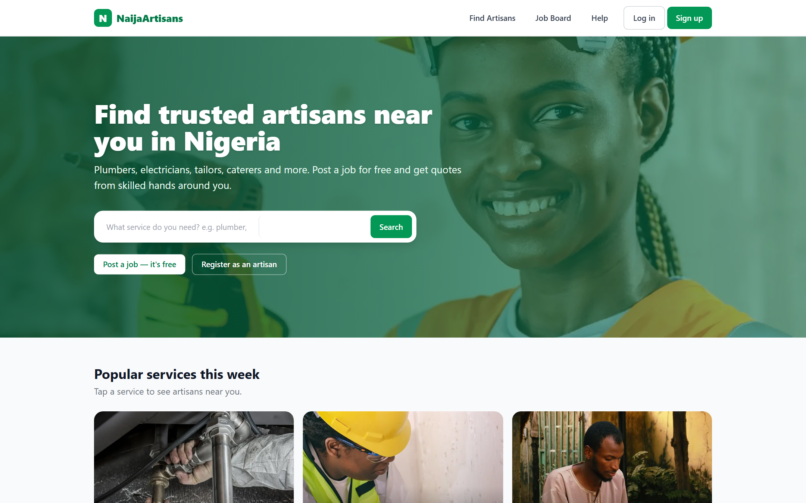
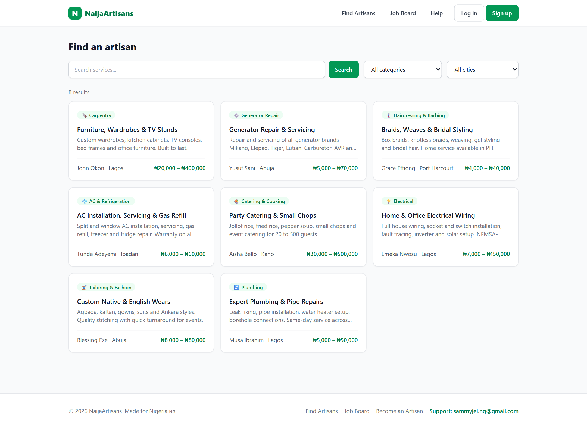
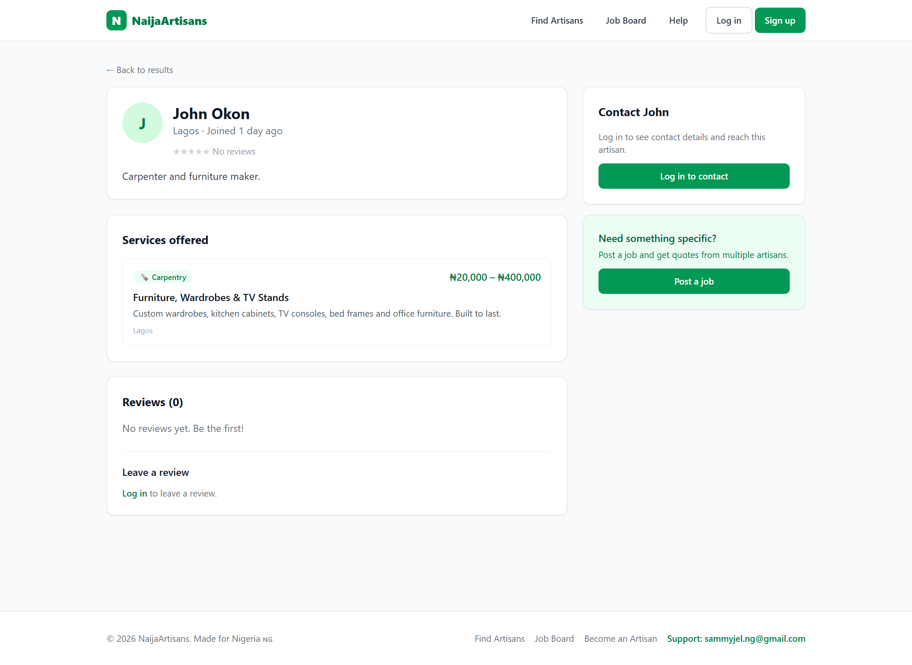
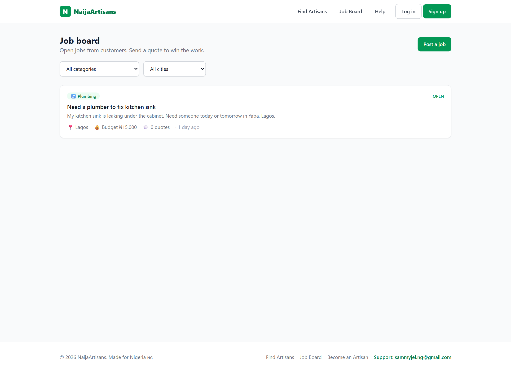
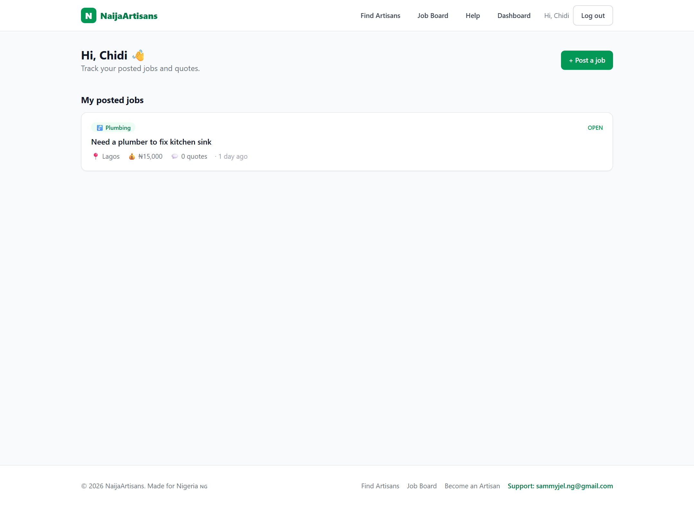

# NaijaArtisans 🇳🇬

> An Armut-style **service marketplace for Nigeria** — connecting skilled artisans (plumbers, electricians, tailors, caterers, mechanics…) with customers who need their services.

**🔗 Live demo: [naijaartisans.vercel.app](https://naijaartisans.vercel.app)**

A full-stack web app built with **Next.js (App Router)**, **Prisma**, and **PostgreSQL** — one codebase serving both the responsive web UI and a clean REST API ready to power a future mobile app.



---

## ✨ Features

**For customers**
- Sign up / log in with **email or phone number**
- Browse & search artisans by **category** and **city**
- View artisan profiles, services, prices and reviews
- **Post a job** for free and receive quotes
- Contact artisans (call / WhatsApp / email)
- Leave ratings & reviews

**For artisans**
- Register with a bio and **list services** (category, price range, city)
- Browse the **job board** and **send quotes** on open jobs
- Manage everything from a role-aware dashboard
- Get a public profile page customers can find

---

## 🖼️ Screenshots

| Browse & search | Artisan profile |
|---|---|
|  |  |

| Job board | Dashboard |
|---|---|
|  |  |

---

## 🛠️ Tech stack

| Layer | Technology |
|---|---|
| Framework | Next.js 14 (App Router), React 18 |
| Styling | Tailwind CSS |
| Database | PostgreSQL (Neon) via Prisma ORM |
| Auth | JWT in http-only cookies, bcrypt password hashing |
| Hosting | Vercel (CI/CD from GitHub) |

---

## 🔑 Demo logins

Password for all demo accounts: **`password123`**

| Role | Login |
|---|---|
| Customer | `customer@demo.com` |
| Artisan | `musa@demo.com` |

---

## 🚀 Run it locally

**Prerequisites:** Node.js 18.18+ and a PostgreSQL database (a free [Neon](https://neon.tech) database works great).

```bash
# 1. Install dependencies
npm install

# 2. Configure environment
cp .env.example .env
#   then set DATABASE_URL, DIRECT_URL and JWT_SECRET in .env

# 3. Create the tables and seed demo data
npm run setup

# 4. Start the dev server
npm run dev
```

Open **http://localhost:3000**.

### Scripts
| Command | Description |
|---|---|
| `npm run dev` | Start the dev server |
| `npm run setup` | Generate client + push schema + seed |
| `npm run db:seed` | Re-run the seed |
| `npm run db:studio` | Open Prisma Studio |
| `npm run build` | Production build |

---

## 🧱 Architecture

```
src/
├─ app/
│  ├─ api/            REST API (auth, services, artisans, jobs, quotes, reviews)
│  ├─ (pages)         home, browse, artisans/[id], jobs, post-job, dashboard, about…
├─ components/        Navbar, AuthProvider, SearchBar, ReviewForm, Stars
└─ lib/               prisma client, auth (JWT + bcrypt), formatting, constants
prisma/
├─ schema.prisma      User, Category, Service, JobRequest, Quote, Review
└─ seed.mjs           Nigerian categories, cities & demo data
```

### API overview
| Method | Endpoint | Purpose |
|---|---|---|
| POST | `/api/auth/register` · `/login` · `/logout` | Auth |
| GET | `/api/categories` | List categories |
| GET / POST | `/api/services` | Search / create services |
| GET | `/api/artisans/:id` | Artisan profile + services + reviews |
| GET / POST | `/api/jobs` | List / post jobs |
| POST | `/api/jobs/:id/quotes` | Send a quote |
| POST | `/api/reviews` | Leave a review |

Auth uses an http-only JWT cookie; the API is structured so a mobile client can reuse it.

---

## 🗺️ Roadmap ideas

- SMS OTP phone verification (Termii / Twilio)
- Artisan portfolio photo uploads
- In-app chat between customer and artisan
- Payments & escrow (Paystack / Flutterwave)
- Map / distance-based search
- React Native mobile app on the same API

---

## 👤 Author

**Built by Sammy** — full-stack portfolio project (design, frontend, backend, database, deployment).

- 🌐 Live: [naijaartisans.vercel.app](https://naijaartisans.vercel.app)
- 📧 [sammyjel.ng@gmail.com](mailto:sammyjel.ng@gmail.com)
